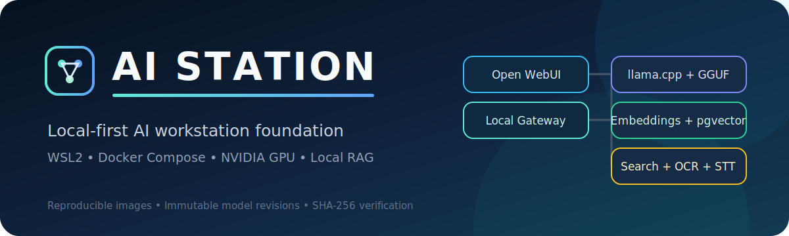

 

### Your models. Your documents. Your machine.

**AI Station** is a polished local AI workstation for private chat, RAG,
document understanding, search, and speech — without sending prompts to a
cloud API.

[Install in minutes](#quick-start) ·
[See the architecture](#architecture) ·
[Read the docs](#documentation) ·
[فارسی](docs/README_FA.md)

---

## Overview

AI Station is a production-oriented local AI foundation for
**Windows 11 + WSL2 + NVIDIA GPUs**.

It combines a browser UI, OpenAI-compatible local inference, document
extraction, Persian OCR, local web search, embeddings, vector storage, and
speech recognition in one controlled environment.

Priorities:

- local data processing;
- reproducible container and model versions;
- explicit operational scripts;
- localhost-only service exposure;
- separation of source from large models and runtime data;
- deterministic release validation.

> Not a public cloud service and not a pile of every AI tool.
> A deliberately constrained workstation you can actually operate.

## Why teams and builders choose it

| You want | AI Station delivers |
|---|---|
| Privacy by default | Loopback-only ports (`127.0.0.1`) — nothing exposed to the LAN unless you choose |
| Something you can trust in production | Digest-pinned images, SHA-256 model manifests, zero-warning release audit |
| One workstation, many projects | LiteLLM multi-project API keys on `:4000` — apps call local OpenAI-compatible endpoints |
| Room to grow without chaos | One heavy GPU model at a time, with an admission controller that explains decisions |
| Evidence over fashion | Engines and retrieval choices are ADR-backed; SGLang was trialled and **not** promoted when it did not fit 24 GiB |

> Stop renting inference for work that should stay on your desk.
> Start with `http://127.0.0.1:3000` and keep the keys, documents, and
> context where they belong.

## Current status

| Area | Status |
|---|---|
| Primary platform | Windows 11 + WSL2 |
| GPU path | NVIDIA CUDA through Docker |
| Main UI | Open WebUI |
| Application API | LiteLLM `:4000` |
| Default LLM | Qwen3.6 35B-A3B GGUF (llama.cpp) |
| Embeddings | Qwen3 Embedding 0.6B |
| Document extraction | Apache Tika + Persian OCR |
| Web search | SearXNG |
| Speech recognition | Local faster-whisper large-v3 |
| Release maturity | Production-oriented baseline on `main` |

Verified acceptance:

~~~text
Errors:   0
Warnings: 0
RELEASE AUDIT PASSED
~~~

## Main capabilities

| Capability | Implementation |
|---|---|
| Local chat interface | Open WebUI |
| Multi-project GenAI API | LiteLLM gateway `:4000` + per-project virtual keys |
| OpenAI-compatible inference | LiteLLM + host gateway + llama.cpp |
| Model switching | `ai models use general\|coder\|reasoning\|vision` |
| GPU inference | NVIDIA CUDA container runtime |
| Retrieval-augmented generation | Open WebUI RAG + local embeddings |
| Vector persistence | PostgreSQL + pgvector |
| Document parsing | Apache Tika |
| Persian and English OCR | Tesseract through Tika |
| Local search | SearXNG |
| Speech-to-text | faster-whisper large-v3 |
| Reproducible containers | SHA-256 image digests |
| Reproducible models | Immutable revisions and SHA-256 checksums |

## Architecture

~~~mermaid
flowchart LR
    U[User / Apps] --> W[Open WebUI 127.0.0.1:3000]
    U --> API[LiteLLM API 127.0.0.1:4000]

    W --> UI[UI Gateway 127.0.0.1:8890]
    UI --> G[Host Gateway 127.0.0.1:8888]
    G --> L[llama.cpp profile 127.0.0.1:8082+]
    API --> L

    W --> E[Embedding 127.0.0.1:8090]
    W --> T[Tika + OCR 127.0.0.1:9998]
    W --> S[SearXNG 127.0.0.1:8889]
    W --> P[(PostgreSQL + pgvector)]
    W --> R[(Redis)]

    L --> M["/srv/ai-station/models"]
    E --> M
~~~

Application code and persistent data stay separated:

~~~text
/opt/ai-station          Application, configuration and scripts
/srv/ai-station          Models, caches, backups and runtime data
~~~

## Requirements

### Host

- Windows 11 with WSL2, or a compatible Ubuntu-based Linux host;
- Docker Engine / Desktop with Compose v2;
- NVIDIA GPU visible via `nvidia-smi`;
- Git, Python 3, OpenSSL, curl, rsync;
- internet access for the first image and model pull.

### Recommended baseline

| Resource | Recommendation |
|---|---|
| GPU VRAM | ~24 GB |
| System RAM | 64 GB |
| Free storage | ≥ 80 GiB |
| Storage | SSD / NVMe |
| CPU | Modern 8-core or better |

## Quick start

### 1. Clone

~~~bash
git clone https://github.com/Ramtin-Karbaschi/ai-station.git
cd ai-station
~~~

### 2. Validate

~~~bash
./scripts/install.sh --validate-only
~~~

### 3. Install

~~~bash
sudo ./scripts/install.sh
~~~

### 4. Open your private console

~~~text
http://127.0.0.1:3000
~~~

The first Open WebUI user becomes the local administrator.

For application projects, create a key and point any OpenAI-compatible
client at `http://127.0.0.1:4000/v1` — see [Platform](docs/PLATFORM.md).

## Model profiles

| Profile | Roles | Purpose |
|---|---|---|
| `core` | General + embedding | Default operation |
| `all` | Core + coder + reasoning + vision + reranker | Full workstation pack |

~~~bash
./scripts/provision-models.sh --profile core
./scripts/verify-models.sh --profile core
~~~

Binaries never live in Git. Checksums live in
[`config/model-manifest.json`](config/model-manifest.json).

## Day-to-day

~~~bash
make help
make start
make status
make verify
make stop
make audit

ai models use general
ai provider start llama-cpp-coder --dry-run
ai projects create my-app
~~~

## Local endpoints

All default ports bind to `127.0.0.1`.

| Service | Endpoint |
|---|---|
| Open WebUI | `http://127.0.0.1:3000` |
| LiteLLM (apps) | `http://127.0.0.1:4000/v1` |
| Host Gateway | `http://127.0.0.1:8888` |
| UI Gateway | `http://127.0.0.1:8890` |
| SearXNG | `http://127.0.0.1:8889` |
| General LLM | `http://127.0.0.1:8082/v1` |
| Embedding | `http://127.0.0.1:8090/v1` |
| Apache Tika | `http://127.0.0.1:9998` |

## Reproducibility and security

1. Registry images pinned by digest.
2. Dockerfile bases pinned by digest.
3. Models pinned by immutable revision + SHA-256.
4. Release audit enforces hygiene and health.
5. Real `.env`, secrets, models, and backups stay out of Git.
6. Loopback binding is the default — not an afterthought.

## Security

- Runtime endpoints bind to loopback by default.
- Real `.env` files, secrets, models, databases and backups are excluded from
  Git.
- Open WebUI authentication is enabled.
- Models and images are cryptographically pinned.
- The default configuration is intended for a trusted local workstation.

Report vulnerabilities privately via [SECURITY.md](SECURITY.md). Do not report
security vulnerabilities through a public issue.

## Support matrix

| Environment | Support |
|---|---|
| Windows 11 + WSL2 + NVIDIA | Validated primary |
| Native Ubuntu + NVIDIA | Best effort |
| Native Windows without WSL2 | Not supported |
| CPU-only default profile | Not supported |
| AMD GPU | Not validated |
| Public internet exposure | Unsupported |
| Multi-node | Out of scope |

## Documentation

| Document | Purpose |
|---|---|
| [Installation](docs/INSTALLATION.md) | Install and upgrade |
| [Architecture](docs/ARCHITECTURE.md) | Flows and trust boundaries |
| [Platform](docs/PLATFORM.md) | LiteLLM, projects, CLI |
| [Scripts](docs/SCRIPTS.md) | Canonical script map |
| [Operations](docs/OPERATIONS.md) | Start, stop, verify |
| [Models](docs/MODELS.md) | Profiles and checksums |
| [Current state](docs/ops/AI_STATION_CURRENT_STATE.md) | Verified baseline |
| [ADRs](docs/adr/) | Architecture decisions |
| [راهنمای فارسی](docs/README_FA.md) | معرفی و شروع سریع |

## Scope

**In:** local inference, embeddings, RAG, OCR, search, STT, install/verify tooling.

**Out:** public SaaS, Kubernetes, cloud inference APIs, training loops,
unrestricted internet-facing access, arbitrary hardware guarantees.

## Contributing

Read [CONTRIBUTING.md](CONTRIBUTING.md) before opening an issue or PR.

## License

AI Station source code and project documentation are licensed under the
[MIT License](LICENSE).

Copyright © 2026 **Ramtin Karbaschi**.

Third-party containers, libraries, and models keep their own licenses —
[THIRD_PARTY_NOTICES.md](THIRD_PARTY_NOTICES.md).

---

**Private by design. Reproducible by default. Ready when you are.**

[Clone the repo](https://github.com/Ramtin-Karbaschi/ai-station) ·
[Open the docs](docs/INSTALLATION.md) ·
[Talk to your models on localhost](#quick-start)

